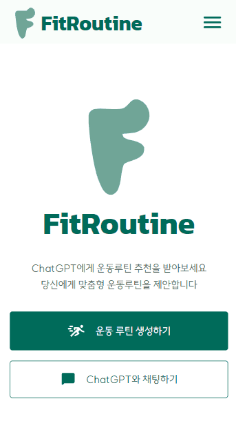
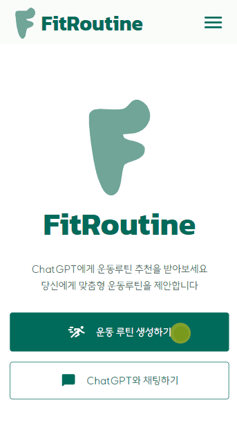
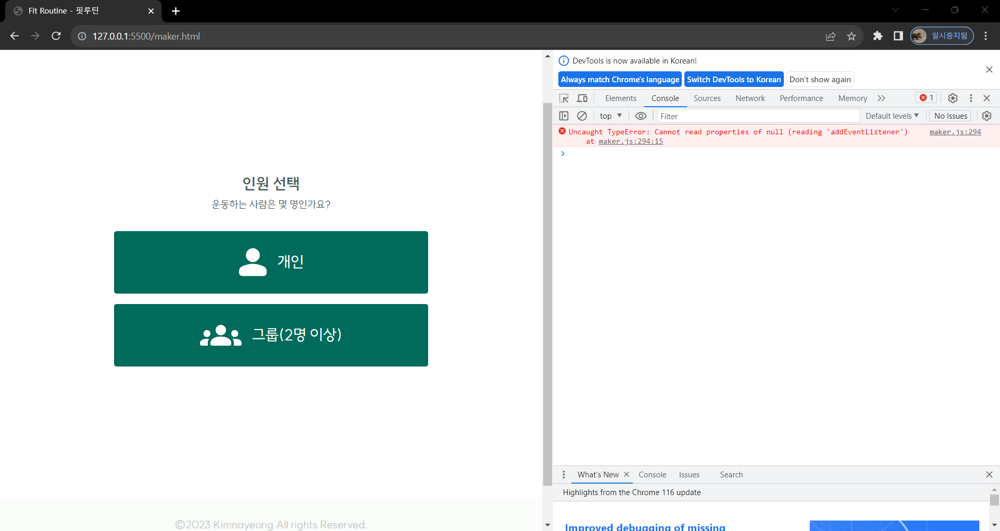

# FitRoutine
<div>
  
  
  
  
  
  
</div> 

ChatGPT의 운동 루틴 추천


## 개요
핏루틴은 사용자에게 맞춤형 운동 루틴을 제공하여 건강한 생활 습관을 돕는 서비스입니다.

## 주요기능

### 사용자 정보 및 목표 설정
>  미리 '사용자 입력 양식'을 줌으로써, 챗지피티와 사용자의 원할한 상호작용을 도울 수 있습니다.

1. 미리 정의된 양식을 제공하면 사용자가 어떤 유형의 정보를 제공해야 하는지 명확하게 이해할 수 있습니다.
2. 데이터의 일관성과 정확성을 높이기 위해, 양식을 통해 입력을 요청하도록 유도합니다.
3. 사용자가 텍스트로 모든 정보를 입력하는 대신 미리 선택할 수 있는 옵션을 제공하면 사용자 경험을 향상시킵니다.
드롭다운 메뉴, 라디오 버튼 등을 활용하여 사용자에게 더 편리한 방법을 제공합니다.

### 운동 루틴 추천
> ChatGPT API를 활용하여 사용자의 상황에 따른 운동 루틴을 제안합니다.

1. ChatGPT API를 활용하여 개인화된 운동 루틴 추천이 가능합니다.
2. 사용자의 운동 선호도와 부위에 따라 운동 계획 제안합니다.

### 채팅
> ChatGPT와의 채팅을 통해 어디서나 실시간 가이드를 지원합니다.

1. 사용자가 운동 중에도 AI 채팅을 통해 질문하고 피드백을 받을 수 있습니다.
2.  ChatGPT는 시간과 장소에 구애받지 않고 사용자에게 지원을 제공하므로, 사용자들은 언제든지 도움을 받을 수 있습니다.

## IA

##  UI / BM

메인 페이지, 사용자 데이터 입력 양식, 결과 페이지, 채팅 페이지로 이뤄져있습니다.

|              주요 구현               |     상세 설명     |
| :----------------------------------: |:--------------- |
| |네비게이션<p>[메인페이지, 메뉴리스트]</p> <p>메인화면 뿐만 아니라, 네비게이션을 통해 사용자가 원하는 페이지를 쉽게 찾고 이동할 수 있습니다.</p>|
||개인맞춤루틴<p>[운동인원선택(개인), 사용자 정보 입력(두 부분으로 나눔), 결과 화면, 채팅 페이지]</p> <p>개인 맞춤형 운동 루틴 형성 페이지입니다.</p><p>드롭다운 메뉴, 라디오 버튼 등을 활용하여 사용자에게 더 편리한 방법을 제공합니다.</p><p>결과화면에서 채팅페이지로 바로 넘어갈 수 있게하여 사용자가 구체적인 정보를 더 원할 때 이용 할 수 있도록 했습니다.</p>|
||그룹맞춤루틴<p>[운동인원선택(그룹), 사용자 정보 입력, 결과 화면, 채팅 페이지]</p> <p>그룹 맞춤형 운동 루틴 형성 페이지입니다.</p><p>드롭다운 메뉴, 라디오 버튼 등을 활용하여 사용자에게 더 편리한 방법을 제공합니다.</p><p>결과화면에서 채팅페이지로 바로 넘어갈 수 있게하여 사용자가 구체적인 정보를 더 원할 때 이용 할 수 있도록 했습니다.</p>|

## 문제 해결 부분
이 서비스를 처음 만들었을때 한 페이지에 모든 화면 구성을 넣고, 자바스크립트로 기능을 구현했습니다. 헤드, 메인, 푸터로 이뤄진 사이에서 메인화면만 바꿀 수 있도록 했었지만, 이 과정에서 해당 요소를 찾을 수 없다는 타입에러가 발생했습니다. 이로인해 메인화면에 적용된 자바스크립트 코드가 아예 실행되지 않았습니다.

자세히 알아보니 랜더링된 문서에서 자바스크립트에서 원하는 요소를 찾지 못해서 addEventListener가 실행되지 않다는 것을 알게되었습니다.
그래서 한 페이지에 모아서 구현하는 것 대신 아래와 같이 페이지를 나눠서 문제를 해결했습니다.

```
┣ 📦maker
┃  ┣ 📂group
┃  ┃ ┗ 📜index.html
┃  ┣ 📂user
┃  ┃ ┣ 📜checkMore.html
┃  ┃ ┗ 📜index.html
┃  ┣ 📜index.html
┃  ┗ 📜result.html
┣ 📜chat.html
┗ 📜index.html
 ```

 ## 느낀점
 요즘 chatGPT가 사회에서 많이 이용되는데, 저도 미니 프로젝트를 통해서 ChatGPT로 나만의 웹 서비스를 만들게 되어서 좋았습니다.  
 UI 구현을 목표로 했던 프로젝트라 프롬프트 엔지니어링 부분이 좀 부족하다는 것이 아쉬웠습니다.  
 그리고 코드 구현력이 아직 낮아 의도했던대로 되지 않는 것들도 있어서 개인공부의 필요성을 느끼게 된 것 같습니다.  
 미래에 더 나은 서비스를 개발하기위해서 열심히 공부해야겠다는 동기가 되었습니다.